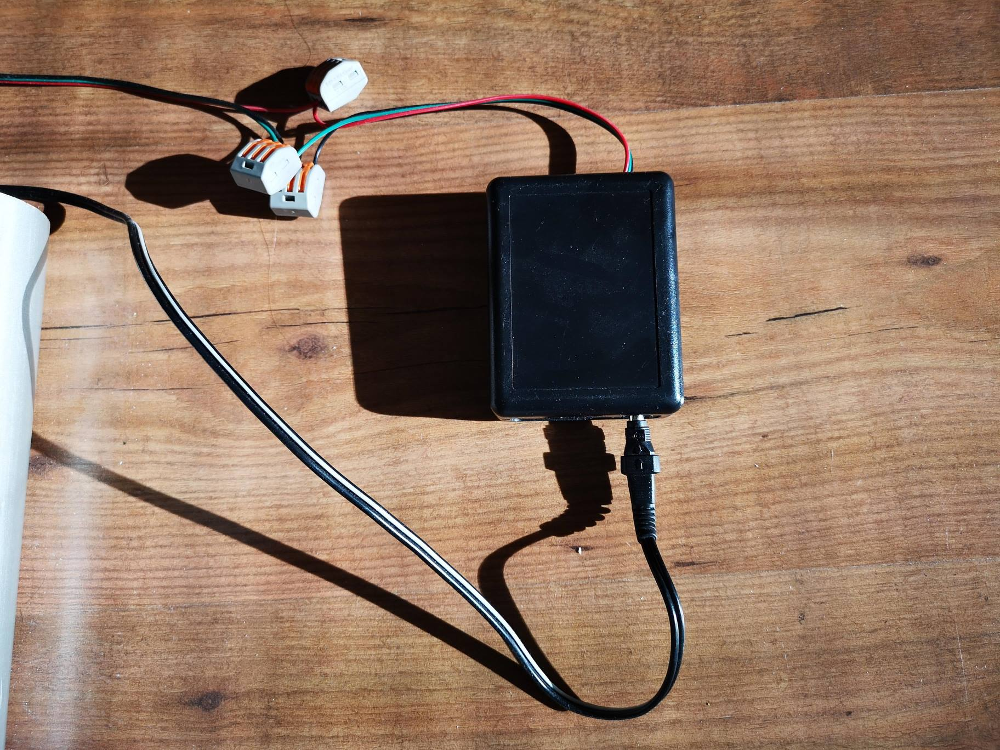
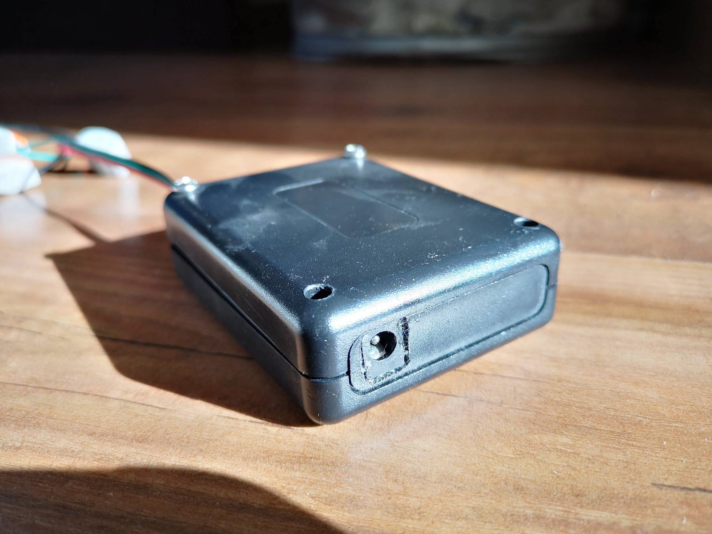
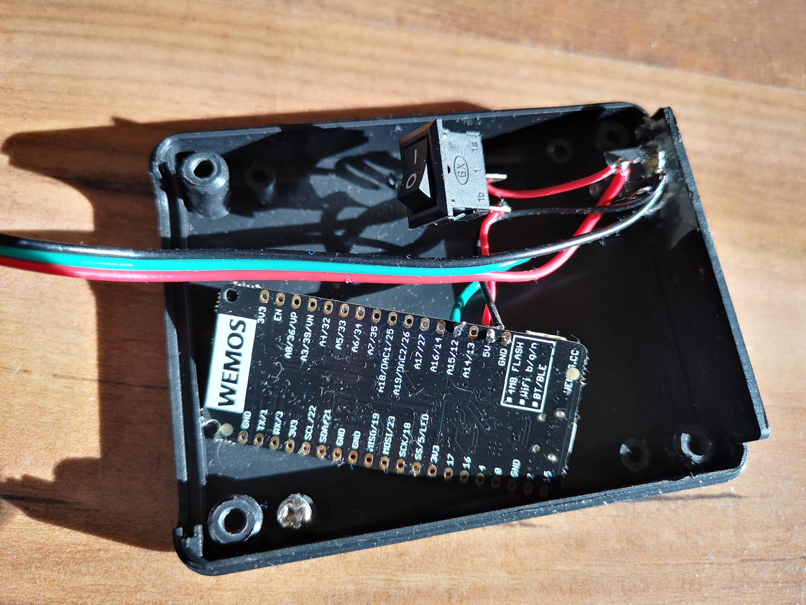

# RGB LED strip decoration - Christmas 2017

## WS2812B LED strip animations using modified FastLED for ESP32. With WiFi Over-The-Air (OTA) firmware upgrades.

## Demonstration video:
(may take a while to load...)

### Please compile and run under: 
### 
### [PlatformIO IDE](http://platformio.org/platformio-ide)

---

### Libraries used:
- `FastLED`
- `FreeRTOS`
- `ArduinoOTA`
- `WiFiManager`

Project is built with [Arduino for ESP32](https://github.com/espressif/arduino-esp32) project.

### Notes
- I've used pin **5** for WS2812B output on the ESP32
- All dependencies should be installed from `platformio.ini`'s **lib_deps**
- I had to include whole FastLED library in the repo, it's in `\lib\FastLED` folder, because the version that was stable at the time couldn't compile to ESP32 without changing few lines of code
- I've used 5V 3A wall adapter as power source for this strip, and added a switch whether to power from USB or the wall adapter

#### TODO
- Schematic
- ~~Add picture of the box~~

You see that Wemos' pin 12 (A15) is connected as data pin for the strip. There's a switch that unconnects the +5V power from the adapter while the board is powered via USB.

For more info feel free to contact me.

## License

MIT license.